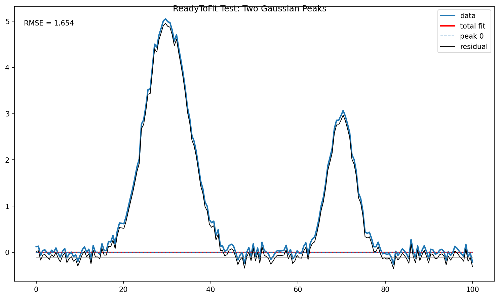

# 📊 ReadyToFit — PeakFit Functions

A flexible and modular Python toolkit for multi-peak curve fitting, parameter management, visualization, and area analysis using scipy.optimize.curve_fit.

This package is designed to handle arbitrary numbers of peaks with different models (Gaussian, Voigt, Asymmetric, Skewed), including support for fixed parameters (e.g., fixed peak centers μ).

## 🚀 Features
🔹 **Automatic peak detection** — Intelligently finds peaks and estimates initial parameters  
🔹 Multi-peak fitting with arbitrary peak count  
🔹 Multiple peak models:  
&emsp;- Gaussian  
&emsp;- Voigt  
&emsp;- Asymmetric  
&emsp;- Skewed  
🔹 Support for fixed parameters (e.g., μ fixed per peak)  
🔹 Automatic parameter flattening/unflattening  
🔹 Intelligent initial guess generation from data  
🔹 Flexible bounds handling  
🔹 Full peak decomposition after fitting  
🔹 Area integration for peaks and total signal  
🔹 Clean visualization with residuals and RMSE  

## ⚙️ Installation

Install from source:
```
git clone https://github.com/your-username/ReadyToFit.git
cd ReadyToFit
pip install .
```

Or install directly from GitHub:
```
pip install git+https://github.com/your-username/ReadyToFit.git
```

Dependencies: numpy, scipy, matplotlib (automatically installed).

## 🧠 Core Concept
Each peak is defined as a dictionary:
```python
peaks = [
    {"model": "gauss"},
    {"model": "voigt", "mu": 50},  # fixed center at x=50
    {"model": "asym"}
]
```

The system automatically:  
- Detects peaks in data using `scipy.signal.find_peaks`
- Estimates initial parameters (amplitude, position, width) from data
- Builds the composite model (sum of all peaks)
- Flattens parameters for optimization
- Handles fixed parameters (removed from optimization, reinstated after fit)
- Reconstructs fitted peaks

## 🔍 Automatic p0 Generation & Peak Detection

**The Problem:** Multi-peak fitting requires good initial guesses (`p0`). Bad guesses lead to poor convergence or fitting the wrong peaks.

**The Solution:** ReadyToFit includes intelligent **automatic peak detection**:

1. **Peak Detection** (`detect_peaks()`):
   - Finds local maxima using local gradient analysis
   - Filters by prominence (relative height above baseline)
   - Estimates peak positions, amplitudes, and widths

2. **Parameter Estimation** (`estimate_initial_parameters()`):
   - Converts detected peaks into initial parameter guesses
   - Estimates widths from Full-Width-Half-Maximum (FWHM)
   - Respects user-defined fixed parameters (not overridden)

3. **Automatic p0**:
   - When `fit_model()` is called without `p0`, it auto-generates it
   - Much more robust than naive guesses (e.g., same μ for all peaks)
   - Can be overridden by providing manual `p0` if needed

**Example:**
```python
from readytofit import detect_peaks

# Detect peaks manually (optional — fit_model() does this automatically)
detected = detect_peaks(x, y, n_peaks=3)
# Returns: [{"mu": 25.5, "A": 4.8, "sigma": 5.1}, ...]
```  

## 📈 Usage Examples

### Automatic Peak Detection & Fitting (Recommended)

The simplest approach: ReadyToFit **automatically detects peaks and estimates initial parameters**.

```python
from readytofit import fit_model
import numpy as np
import matplotlib.pyplot as plt

# Your noisy multi-peak data
x = np.array([...])
y = np.array([...])

# Define peak structure (models only — parameters auto-detected)
peaks = [
    {"model": "gauss"},
    {"model": "gauss"},
    {"model": "voigt"}
]

# Fit — p0 and initial parameters are auto-generated!
result = fit_model(x, y, peaks)

print(f"RMSE: {result['rmse']:.4f}")
print("Fitted parameters per peak:")
for i, peak_params in enumerate(result["params"]):
    print(f"  Peak {i+1}: {peak_params}")
```

**How auto-detection works:**
1. **Peak finding**: Uses `scipy.signal.find_peaks` to locate local maxima
2. **Parameter estimation**: Estimates amplitude (A), center (μ), and width (σ) from data
3. **Smart initial guess**: Provides excellent starting point for optimization
4. **Respects fixed parameters**: If you specify `"mu": 50`, it's locked and not overridden

### With Fixed Parameters

Lock specific parameter values (e.g., peak center):

```python
peaks = [
    {"model": "gauss"},              # All parameters free
    {"model": "gauss", "mu": 50},    # Center fixed at x=50
    {"model": "voigt", "mu": 80}     # Center fixed at x=80
]

result = fit_model(x, y, peaks)

# View results (fixed parameters are preserved in result["params"])
assert result["params"][1]["mu"] == 50  # mu is locked
assert result["params"][1]["A"] is not None  # A and sigma are fitted
```

### Manual Initial Guess (Advanced)

Override automatic detection with manual p0:

```python
# Manual initial guesses (if you know better than auto-detection!)
p0 = [
    {"A": 100, "mu": 25, "sigma": 5},
    {"A": 80, "mu": 75, "sigma": 6}
]

result = fit_model(x, y, peaks, p0=p0)
```

### Plotting Results

```python
from readytofit import plot_fit_result

fig, ax = plt.subplots(figsize=(10, 6))
plot_fit_result(x, y, result, show_residual=True, show_rmse=True, fig=fig, ax=ax)
fig.suptitle("Multi-Peak Fitting Results")
plt.savefig("fit_result.png")
plt.close()
```

**Example output:**



### Computing Peak Areas

```python
from readytofit import evaluate_peak_areas

areas = evaluate_peak_areas(x, result)

print(f"Total signal area: {areas['total']:.2f}")
print(f"Individual peak areas: {areas['peaks']}")
```

### Automatic Peak Detection (Standalone)

Detect peaks without fitting:

```python
from readytofit import detect_peaks

detected = detect_peaks(x, y, n_peaks=3)

for i, peak in enumerate(detected):
    print(f"Peak {i+1}:")
    print(f"  Center (μ): {peak['mu']:.2f}")
    print(f"  Amplitude (A): {peak['A']:.3f}")
    print(f"  Width (σ): {peak['sigma']:.3f}")
```
## 📊 fit_model() Output

The `fit_model()` function returns a comprehensive results dictionary:

```python
result = {
    # Parameters
    "popt": [...],                    # Optimized parameters (flat, free only)
    "params": [                       # Structured parameters per peak
        {"A": 5.0, "mu": 30.0, "sigma": 5.1},
        {"A": 3.0, "mu": 70.0, "sigma": 3.0}
    ],
    
    # Fitted curves
    "total_fit": [...],               # Full reconstructed signal
    "peak_fits": [...],               # Individual peaks
    
    # Diagnostics
    "residual": [...],                # y - total_fit
    "rmse": 0.1006,                   # Root mean square error
    
    # Metadata
    "param_names": [...],             # Names of free parameters
    "param_slices": [...],            # Index mapping per peak
    "model_function": callable,       # Composite model function
    "p0": [...],                      # Initial guess used
    "bounds": (lower, upper)          # Bounds used in optimization
}
```

**Access results:**
```python
# Check fit quality
print(f"RMSE: {result['rmse']:.4f}")

# Get all parameters (including fixed ones)
for i, peak in enumerate(result["params"]):
    print(f"Peak {i}: {peak}")

# Get fitted curve and residuals
y_fitted = result["total_fit"]
residuals = result["residual"]

# Get individual peak contributions
for i, peak_curve in enumerate(result["peak_fits"]):
    plt.plot(x, peak_curve, label=f"Peak {i}")
```

## 🔬 Supported Peak Models
|Model	|Parameters  | Use Case |
|-------|------------|----------|
|gauss	|A, μ, σ | Symmetric peaks (most common) |
|voigt	|A, μ, σ, γ | Symmetric peaks with natural broadening |
|asym	|A, μ, σL, σR, γ | Asymmetric peaks (different left/right widths) |
|skew	|A, μ, σ, γ, α | Peaks with asymmetric tails |

**Legend:**
- **A**: Amplitude (peak height above baseline)
- **μ**: Center position (can be fixed: `{"model": "gauss", "mu": 50}`)
- **σ**: Standard deviation (width parameter)
- **σL, σR**: Left/right widths for asymmetric model
- **γ**: Lorentz width (natural line broadening)
- **α**: Skew parameter (asymmetry control)

Fixed parameters are removed from optimization. Example:
```python
{"model": "gauss", "mu": 50}
# → Only A and sigma are fitted; mu is locked at 50
```

## 📐 Key Features in Detail
🔹 **Automatic parameter handling**  
No manual indexing required — parameters are flattened internally and fixed parameters are properly managed.

🔹 **Robust fitting pipeline**  
Handles missing p0, partial bounds, and invalid input gracefully with intelligent fallbacks.

🔹 **Full decomposition**  
Inspect total fit, individual peaks, residuals, and peak areas independently.

🔹 **Peak detection**  
`detect_peaks()` and `estimate_initial_parameters()` enable automatic initial guess generation.

## 📚 Public API Reference

### Core Fitting
- **`fit_model(x, y, peaks, p0=None, bounds=None, debug=False)`**  
  Main fitting function. Automatically detects peaks and estimates p0 if not provided.

### Visualization
- **`plot_fit_result(x, y, result, show_residual=True, show_rmse=True, fig=None, ax=None)`**  
  Plot raw data, total fit, individual peaks, residuals, and RMSE.

### Peak Detection
- **`detect_peaks(x, y, n_peaks=None, height_threshold=0.1, prominence_threshold=None, distance=None)`**  
  Automatically detect peaks. Returns list of peak dictionaries with estimated parameters.

- **`estimate_initial_parameters(x, y, peaks)`**  
  Estimate initial parameters from data. Respects fixed parameters in peak definitions.

### Area Integration
- **`evaluate_peak_areas(x, result)`**  
  Compute areas of total fit and individual peaks using trapezoidal rule.

- **`area_integration(y, x=None)`**  
  Low-level numerical integration utility.

## � Dependencies
numpy  
scipy  
matplotlib

## ⭐ Author Notes

This project is designed as a modular research-grade fitting system, not a black-box tool.
Each component can be reused independently in scientific workflows.

### To add new peak types

To add new functions you need the following changes:
- Insert the function definition into functions.py
- Add dedicated section in get_model() inside functions.py
- Add dedicated entry inside the PARAM_ORDER dictionary inside parameters.py
- Add dedicated section in generate_default_p0() inside parameters.py
- Add the new peak name into *peak_types* variable inside test.py in the peaks import section 